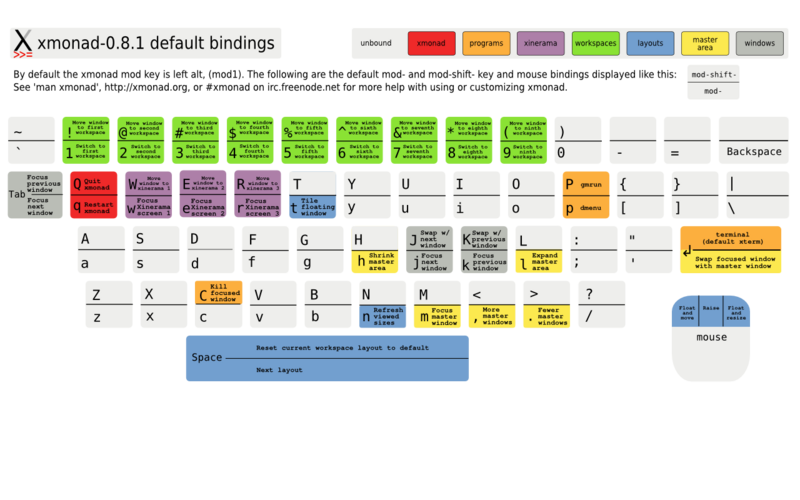

!SLIDE bullets
.notes first slide

# <3 xmonad teh awesome FTW pls RT
## [@scottbale](http://twitter.com/scottbale), Revelytix  ##

!SLIDE bullets  transition=scrollUp

* xmonad.org
* tiling window manager for X
* xinerama
* haskell
* emacs

!SLIDE center transition=scrollUp

!SLIDE center transition=scrollUp

!SLIDE center transition=scrollUp

# StackSet

    Workspace  { 0*}   { 1 }   { 2 }   { 3 }

    Windows    [1      []      [3*     [6*]
               ,2*]            ,4
                               ,5]

    Xinerama    2               1

[xmonad.org/xmonad-docs/xmonad/XMonad-StackSet.html](http://xmonad.org/xmonad-docs/xmonad/XMonad-StackSet.html)

!SLIDE transition=scrollUp

# Custom keybinding #

    @@@ haskell
    myCustomFunction :: WindowSet->WindowSet

!SLIDE 

# Custom keybinding #

    @@@ haskell
    myCustomFunction :: WindowSet->WindowSet
    myCustomFunction = doToNextScreen W.view

!SLIDE

# Custom keybinding #

    @@@ haskell
    myCustomFunction :: WindowSet->WindowSet
    myCustomFunction = doToNextScreen moveWin
      where moveWin i ws 
                  = W.view i (W.shift i ws)

!SLIDE

# Custom keybinding #

    @@@ haskell
    myCustomFunction :: WindowSet->WindowSet
    myCustomFunction = doToNextScreen moveWin
      where moveWin i ws 
                  = W.view i (W.shift i ws)

    -- takes a function that operates on a 
    -- workspace ID, and invokes it using the 
    -- workspace ID of the next screen.
    doToNextScreen :: 
      (WorkspaceId->WindowSet->WindowSet) -> 
      WindowSet -> WindowSet

!SLIDE bullets transition=scrollUp

* [xmonad.org](http://xmonad.org/)
* [my config](https://github.com/scottbale/xmonad-config)
* [xmonad API doc](http://xmonad.org/xmonad-docs/xmonad/index.html)
* [installing xmonad for ubuntu](http://www.haskell.org/haskellwiki/Xmonad/Using_xmonad_in_Gnome)
